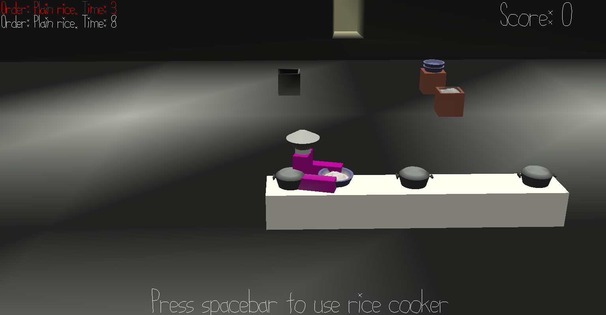

# RoboChef

Author: Kyle Jannak-Huang

Design: This game is like Overcooked, except there are no visual to tell when food is ready. You have to listen to the audio cue of water boiling to tell that the food is ready.

Anti-Design: This game is functional but fairly boring because I didn't have time to add more ingredients, sounds, or even collisions with the basic terrain in the kitchen. If I had another week it could be a pretty fun time-management game though.

Screen Shot:

How To Play:

Game summary:

This game is similar to Scrapped!, but this time you are a robot chef. Prepare meals for the customers as quickly as possible using the available pots.

Grab empty bowls from the stack and use them to scoop uncooked rice into the pots. When the rice is ready, it will make a rolling boil sound, at which point you should take it out fairly quickly or it will burn.

The sound is based on the character location, not the camera, since the camera is 3rd person.

Go to the delivery window with cooked rice to score. If you burn your rice, you will need to throw it in the trash can and start over. You will lose points if the customers get impatient.

Controls:

Camera controls:
Click and drag with right-click to rotate the camera. Use the scroll-wheel to zoom in and out.

Player controls:
Use WASD to move. If you move while holding right-click, you will move in the direction of the camera. Otherwise, you will move in the direction you are already facing.

Use spacebar to interact with objects.

Sources: 

Boiling water sound was downloaded from https://freesound.org/people/urupin/sounds/157694/ under the Attribution 3.0 license. It was clipped to be shorter.
Bell ding sound was downloaded from https://freesound.org/people/InspectorJ/sounds/415510/ under the Attribution 3.0 license. It was unchanged.

Background track:
Faster Does It by Kevin MacLeod
Link: https://incompetech.filmmusic.io/song/3741-faster-does-it
License: http://creativecommons.org/licenses/by/4.0/

This game was built with [NEST](NEST.md).

